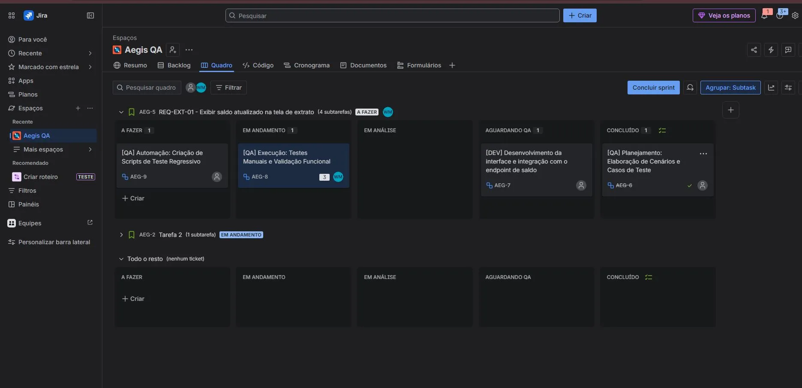

# 🏦 BugBank — Estratégia de Testes & Engenharia de Qualidade (QA)

Projeto de governança e garantia de qualidade aplicado à funcionalidade de **Extrato Bancário** do **BugBank** (simulador bancário digital). 

Este repositório demonstra a aplicação prática do ciclo de vida de testes de software (STLC), cobrindo desde a análise de requisitos até o reporte de defeitos e planejamento de automação com abordagem ágil.

---

## 📌 Links do Projeto

* 🔗 **Documentação Completa no Notion:** [Acesse o Workspace do Notion aqui](https://enormous-allium-7ed.notion.site/BugBank-Vis-o-Geral-do-Produto-371be058465180c293baf1b5e2fc818c?source=copy_link)
* 🎯 **Aplicação Alvo:** [BugBank Web](https://bugbank.netlify.app/)

---

## 🎯 Escopo & Abordagem de Testes

* **Módulo em Foco:** Extrato Bancário (jornada financeira do usuário).
* **Tipos de Teste:** Testes Funcionais Manuais (regras de negócio e layout) e Testes de Regressão.
* **Critério de Entrada:** Feature disponível em ambiente de testes e card movido para *In Test/Aguardando QA* no Jira.
* **Critério de Saída (DoD):** 100% dos Casos de Teste críticos executados e nenhum bug com severidade *Alta* ou *Crítica* em aberto.

---

## 🧭 Gerenciamento Ágil & Shift-Left (Jira)

A esteira de qualidade foi modelada utilizando **Jira Software**, aplicando o conceito de *Shift-Left Testing* (planejamento e escrita de cenários antes do deploy do código).

* **Planejamento de QA:** Elaboração de cenários e casos de teste concluída antecipadamente.
* **Desenvolvimento:** Finalizado por Dev e movido para *Aguardando QA*.
* **Execução de Testes:** Validação manual funcional e critérios de aceite em andamento.
* **Automação de Testes:** Próxima etapa da esteira para regressão contínua com **Cypress**.

---

## 📊 Matriz de Rastreabilidade de Requisitos (RTM)

A matriz garante cobertura total entre o que o negócio exige e o que foi coberto pelos testes:

| ID Requisito | Funcionalidade / Requisito de Negócio | ID Caso de Teste Relacionado |
| :--- | :--- | :--- |
| `REQ-EXT-01` | Exibir saldo atualizado na tela de extrato. | `CT-EXT-01`, `CT-EXT-02` |
| `REQ-EXT-02` | Exibir histórico de transações em ordem cronológica (Data, Descrição e Valor). | `CT-EXT-03` |
| `REQ-EXT-03` | Conta criada com a opção "com saldo" deve iniciar o extrato com R$ 1.000,00. | `CT-EXT-04` |
| `REQ-EXT-04` | Valores de saída (transferências enviadas) devem exibir o sinal de menos (-) e cor vermelha. | `CT-EXT-05` |

---

## 📋 Repositório de Casos de Teste

| ID do Caso | Cenário de Teste | Status |
| :--- | :--- | :--- |
| `CT-EXT-01` | Validar exibição do saldo com conta criada com saldo inicial. | `Executado` |
| `CT-EXT-02` | Validar atualização do saldo após receber uma transferência. | `Executado` |
| `CT-EXT-03` | Validar exibição do histórico de transações em ordem cronológica. | `Executado` |
| `CT-EXT-04` | Validar inclusão do registro de "Abertura de conta" com R$ 1.000,00. | `Executado` |
| `CT-EXT-05` | Validar formatação visual (cor vermelha e sinal de menos) para transferências enviadas. | `Falhou` |

---

## 🐛 Relatório de Bugs Encontrados

| ID do Bug | Título do Defeito / Descrição | Severidade | Status |
| :--- | :--- | :--- | :--- |
| `BUG-EXT-01` | Valor de transferência enviada não exibe a cor vermelha na listagem. | **Média** | Aberto |
| `BUG-EXT-02` | Ao realizar um refresh (F5), todo o histórico de transações é apagado da sessão. | **Alta** | Aberto |
| `BUG-EXT-03` | Campo "Saldo disponível" não decrementa o valor exato após o envio de uma transferência. | **Crítica** | Aberto |

---

## 🛠️ Tecnologias & Ferramentas

* **Notion:** Documentação técnica de requisitos, RTM e repositório de casos de teste.
* **Jira Software:** Gestão ágil, controle de sprint e fluxo de sub-tarefas de QA.
* **DevTools (F12):** Inspeção de elementos visuais e chamadas de rede.
* **Cypress (Próxima etapa):** Automação regressiva end-to-end.

---

Projeto desenvolvido por **Wesley Dias**.

* 💼 **LinkedIn:** https://www.linkedin.com/in/yuuwesley
* 🐙 **GitHub:** [github.com/yuuwesley](https://github.com/yuuwesley)
